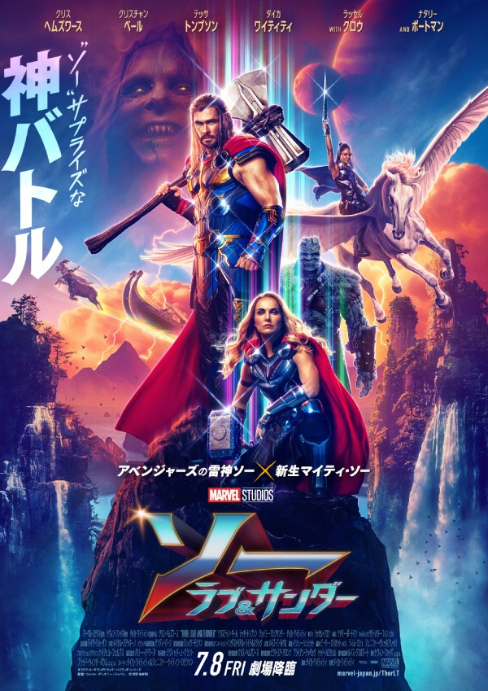
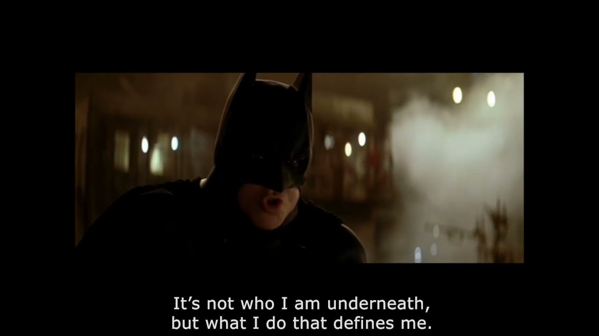

<!-- _class: lead -->

# タイトル
# 長くなったら折り返せば良い

 

修士二年　村瀬 晃

---
<!-- _header: 疑問 -->

- 仮説のもとになる疑問があれば書く

- 複数あれば尚よし

---

<!-- _header: 仮説 -->

- hoge
- hogehoge
- fugafuga
の三つの仮説を立てた

---
<!-- _header: 検証方法 -->

- 検証方法

---
<!-- _header: アイスブレイク -->

**Thor Love and Thunder**がもうすぐ公開ですね! [^1]

[^1]: https://marvel.disney.co.jp/movie/thor-love-and-thunder/about.html

<!-- _footer: . -->

---

<!-- _header: アイスブレイク -->

今回登場するヴィランはバットマンシリーズでお馴染みの
クリスチャンベイルが演じるみたいです。

 

> https://www.youtube.com/watch?v=TAXHwN-ylC4
<!-- _footer: . -->

---

<!-- _header: 結果 -->

表は結果を示している。

| 対象クラス１|対象クラス2|
| :---: | :---: | 
| 結果 | 結果 |

上の表についての解釈を書く

---

もじの大きさも位置も変えられる

あいうえお

デフォルトはここ

右寄せ

---

<!-- _header: 考察とまとめ -->

- marpはいいぞ

